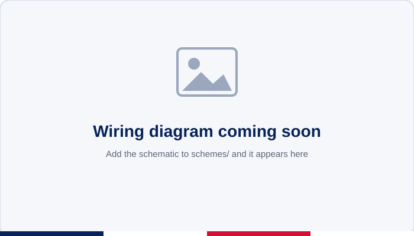
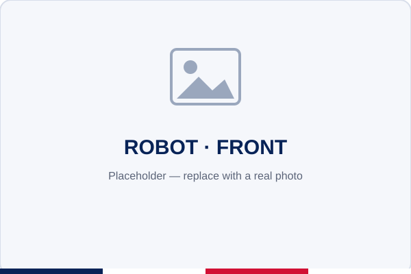
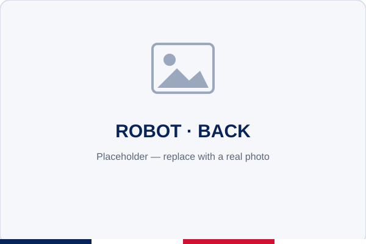
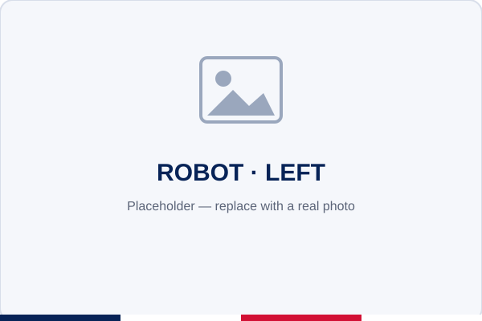
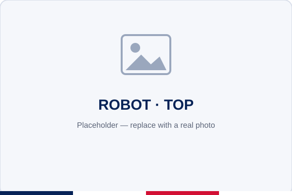
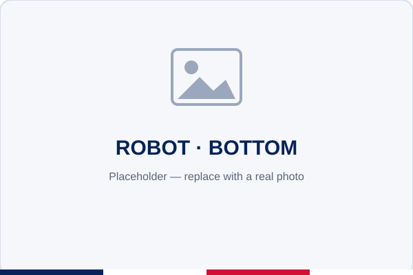
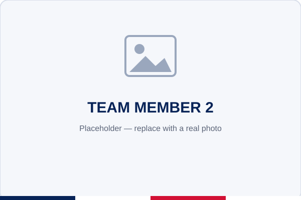

<div align="center">


# Robotech La Salle

### FuturoIng — Self-Driving Vehicle

**WRO&nbsp;2026 · Future&nbsp;Engineers** &nbsp;·&nbsp; **Panamá** 🇵🇦

<sub>This repository contains the engineering materials of a self-driven vehicle's model<br>competing in the WRO Future Engineers competition, season&nbsp;2026.</sub>

<p>
  
  
  
</p>
<p>
  
  
  
  
</p>

<br>


<!-- TODO: replace with v-photos/hero.jpg once the robot is photographed -->

</div>

---

## 📑 Table of Contents

- [🏎️ Overview](#-overview)
- [📂 Content](#-content)
- [🧩 Introduction](#-introduction)
- [🔩 Bill of Materials](#-bill-of-materials)
- [🔌 Wiring](#-wiring)
- [🤖 Vehicle Gallery](#-vehicle-gallery)
- [🎥 Video](#-video)
- [🛠️ Engineering Journey](#-engineering-journey)
- [⚙️ UNO Q Gotchas](#-uno-q-gotchas)
- [👥 Team](#-team)

---

## 🏎️ Overview

An autonomous vehicle built on the **Arduino UNO Q** (App Lab) for the **WRO Future
Engineers** challenge. It steers with a servo, drives with a DC motor through an L298N
driver, holds a straight heading with an **MPU‑6050 (GY‑521)** gyro, and detects
coloured pillars with a Logitech camera.

```
Browser slider ──socket.io──▶ Python (Web UI brick) ──RouterBridge RPC──▶ sketch ──▶ servo on D9
```

> [!NOTE]
> The **Python / Linux side** serves the Web UI and forwards commands to the MCU over
> the RouterBridge; the **sketch / MCU side** runs the real-time gyro steering and motor
> control.

---

## 📂 Content

This repository follows the official **WRO Future Engineers** engineering-materials template:

- **`src`** — control software for every programmed component, plus all build/dependency artifacts (`sketch.yaml`, `requirements.txt`).
- **`v-photos`** — 6 photos of the vehicle (every side, top and bottom).
- **`t-photos`** — 2 photos of the team (one official, one fun).
- **`video`** — `video.md` with the link to the driving-demonstration video.
- **`schemes`** — schematic diagrams of the electromechanical components and how they connect.
- **`other`** — supporting documentation, build notes and the project website.
- **`images`** — branding and reference images used by this README.

> [!NOTE]
> The optional `models/` folder (3D‑print / laser / CNC files) is omitted — the WRO
> template allows removing it when there is nothing to add.

<details>
<summary><b>📁 Folder map</b></summary>

<br>

| Folder | Contents |
|--------|----------|
| 📂 [`src`](src/) | Arduino sketch, Python Web UI, web assets + build artifacts |
| 📷 [`v-photos`](v-photos/) | Vehicle photos (every side, top & bottom) |
| 👥 [`t-photos`](t-photos/) | Team photos (official + fun) |
| 🎥 [`video`](video/) | Driving-demonstration video link |
| 🔌 [`schemes`](schemes/) | Wiring / electronic schematics |
| 📦 [`other`](other/) | Docs, build notes & project website |
| 🖼️ [`images`](images/) | README branding & reference images |

</details>

---

## 🧩 Introduction

### 🧠 Code modules & how they map to the hardware

| Module | Where | Role |
|--------|-------|------|
| **Sensing** | `src/python/vision.py` + `src/sketch` | Logitech camera (pillars/walls) + MPU‑6050 gyro (heading) |
| **Logic** | `src/sketch/sketch.ino` | Gyro heading‑hold **PD** loop — drive straight & sweep corners |
| **Actuation** | `src/sketch/sketch.ino` | Steering servo on **D9** + DC drive motor via the **L298N** |
| **Interface** | `src/python/main.py` + `src/assets` | Web UI (FastAPI) + RouterBridge RPC bridge to the MCU |

### ⚙️ How it works

**Sketch ([`src/sketch/sketch.ino`](src/sketch/sketch.ino))** registers RPC handlers with
`Bridge.provide_safe(...)`:

```cpp
Bridge.provide_safe("set_angle", set_angle);   // servo.write(angle), returns applied angle
Bridge.provide_safe("get_angle", get_angle);   // lets the UI sync on connect
```

> [!WARNING]
> `provide_safe` (not `provide`) is required for anything that touches hardware. It runs
> the callback in the `loop()` context; `provide` runs it on a background RPC thread where
> `servo.write()` / GPIO can misbehave.

**Python ([`src/python/main.py`](src/python/main.py))** exposes simple REST endpoints; a
handler parameter becomes a query parameter (FastAPI):

```python
ui = WebUI()
ui.expose_api("GET", "/api/angle", api_set_angle)  # /api/angle?angle=120
applied = Bridge.call("set_angle", angle)          # python -> MCU
return {"angle": applied}
```

> [!TIP]
> **Why REST and not websockets?** This brick is FastAPI + `fastapi_socketio` and does
> **not** serve a Socket.IO *client* library, so an `io()` page hangs on "Connecting…".
> Plain `fetch()` is rock-solid here.

### 🔧 The library fix (why `Servo.h` wasn't found)

Arduino App Lab does **not** read the classic Arduino IDE library folder. It resolves each
project's MCU libraries from **[`src/sketch/sketch.yaml`](src/sketch/sketch.yaml)**.
`Servo 1.3.0` is the first version with Zephyr / UNO Q support, and App Lab needs the
**profiles** form:

```yaml
profiles:
  default:
    fqbn:                       # left blank — App Lab fills it from the connected UNO Q
    platforms:
      - platform: arduino:zephyr
    libraries:
      - Servo (1.3.0)
default_profile: default
```

### ▶️ Build, compile & upload

1. Open **Arduino App Lab** → open this app.
2. Connect the UNO Q, select it, and click **Run** (compiles + uploads the sketch, starts the Python program).
3. Open the app's **Web UI** (or `http://<board-ip>:7000`) and drive.

> [!NOTE]
> Verify: the build succeeds with no `Servo.h: No such file or directory`, the page shows
> **Connected**, and the servo physically tracks the slider.

<details>
<summary><b>🛠️ STAGE 2 — full FuturoIng robot port (reference)</b></summary>

<br>

The full robot (servo steering + L298N DC motor) reuses the same pattern: keep the
`Arduino_RouterBridge` handlers and add the motor pins.

```cpp
#include <Arduino_RouterBridge.h>
#include <Servo.h>

int MotorVelocityPin = 3;   // ENA / PWM speed
int MotorPin1 = 6, MotorPin2 = 5;   // direction
int CenterServoRotation = 138, ServoPin = 9;
Servo servo;

void setup() {
  pinMode(MotorPin1, OUTPUT); pinMode(MotorPin2, OUTPUT); pinMode(MotorVelocityPin, OUTPUT);
  Bridge.begin(); Monitor.begin(115200);
  servo.attach(ServoPin); servo.write(CenterServoRotation);
}
void loop() { /* obstacle-avoidance / steering logic */ }
```

</details>

---

## 🔩 Bill of Materials

| Component | Qty | Role in the vehicle |
|-----------|:---:|---------------------|
| **Arduino UNO Q** | 1 | Main controller (Linux SBC + MCU) running Arduino App Lab |
| **L298N** dual H-bridge | 1 | Motor driver for the DC drive motor |
| **DC drive motor** | 1 | Propels the vehicle — driven by the L298N |
| **Steering servo** | 1 | Steers the front wheels (servo signal on D9) |
| **GY-521 (MPU-6050)** gyroscope | 1 | 6-axis gyro / accelerometer — heading hold (yaw) |
| **Logitech camera** | 1 | USB webcam for computer vision (pillar colour & obstacle detection) |
| **12 V battery** | 1 | Main power supply |
| **Jumper cables** | as needed | Wiring between controller, driver, sensors and motor |

> [!NOTE]
> Component photos will appear here once added to [`images/components/`](images/components/)
> (filenames are listed in that folder's README).

---

## 🔌 Wiring

| Servo wire | Connect to |
|------------|------------|
| Signal (orange/white) | **D9** |
| V+ (red) | external **5–6 V** supply |
| GND (brown/black) | supply GND **and** a board GND (shared ground) |

<div align="center">

<!-- TODO: replace with schemes/wiring.png once the schematic is drawn -->
</div>

<details>
<summary><b>🔧 Full pin map</b></summary>

<br>

| Signal | Pin | Notes |
|--------|-----|-------|
| Steering servo | **D9** | PWM-capable on the UNO Q |
| Motor ENA (speed) | **D3** | L298N PWM |
| Motor IN1 / IN2 | **D6 / D5** | L298N direction |
| MPU-6050 SDA / SCL | **A4 / A5** | I²C (core ≥ 0.55.2) |

</details>

---

## 🤖 Vehicle Gallery

> [!NOTE]
> Photos are **placeholders** — drop the real shots into [`v-photos/`](v-photos/) and the
> grid updates. A driving-demo GIF will sit at the top once recorded.

<div align="center">

|  |  |  |
|:--:|:--:|:--:|
| **Front** | **Back** | **Left** |
|  |  |  |
| **Right** | **Top** | **Bottom** |

</div>

---

## 🎥 Video

The driving-demonstration video link lives in [`video/video.md`](video/video.md).

> [!NOTE]
> A hosted video isn't published yet. Once it is, this section shows a clickable YouTube
> thumbnail linking to the run.

---

## 🛠️ Engineering Journey

> [!NOTE]
> The full story of the problems we solved — the Raspberry Pi first version, the servo‑PWM
> issue, the switch to the Arduino UNO Q, and the web‑UI servo calibration (**centre = 79°**)
> — is written up in **[`other/fabrication-challenges.md`](other/fabrication-challenges.md)**.

---

## ⚙️ UNO Q Gotchas

> [!WARNING]
> - **PWM pins:** on Zephyr `servo.attach(pin)` needs a hardware-PWM pin. If the servo
>   doesn't move on **D9**, try another PWM header pin (e.g. D3 or D6).
> - Keep **Servo ≥ 1.3.0** in `sketch.yaml`.
> - The UNO Q I²C is core-version-dependent — use **A4/A5** with core **≥ 0.55.2**; the
>   Qwiic connector has been reported flaky.
> - Use App Lab's **`Monitor`**, not the classic IDE Serial Monitor.

---

## 👥 Team

**Robotech La Salle** — La Salle, Panamá 🇵🇦

<div align="center">

|  |  |
|:--:|:--:|
| **Official team photo** | **Team (fun)** |
|  |  |
| **Member** | **Member** |

</div>

> [!NOTE]
> Team photos are **placeholders** — add the real photos to [`t-photos/`](t-photos/) and
> the names/roles here, and I'll wire them in.

<div align="center">
<br>

<br>
<sub>Built by <b>Robotech La Salle</b> · Panamá 🇵🇦 · WRO 2026 — Future Engineers</sub>
</div>
