<div align="center">


# WongWongLinares La Salle

### FuturoIng — Self-Driving Vehicle

**WRO&nbsp;2026 · Future&nbsp;Engineers** &nbsp;·&nbsp; **Panamá** 🇵🇦

<sub>This repository contains the engineering materials of a self-driven vehicle's model<br>competing in the WRO Future Engineers competition, season&nbsp;2026.</sub>

<p>
  
  
  
</p>
<p>
  
  
  
  
</p>

</div>

---

## 📑 Table of Contents

- [🏎️ Overview](#-overview)
- [📂 Content](#-content)
- [🧩 Introduction](#-introduction)
- [🔩 Materials & Specs](#-materials)
- [🔌 Wiring](#-wiring)
- [🤖 Vehicle Gallery](#-vehicle-gallery)
- [🎥 Video](#-video)
- [🛠️ Engineering Journey](#-engineering-journey)
- [⚙️ UNO Q Gotchas](#-uno-q-gotchas)
- [👥 Team](#-team)

---

## 🏎️ Overview

An autonomous vehicle built on the **Arduino UNO Q** (App Lab) for the **WRO Future
Engineers** challenge. It steers with a servo, drives with a DC motor through an L298N
driver, holds a straight heading with an **MPU‑6050 (GY‑521)** gyro, and detects
coloured pillars with a Logitech camera.

```
Browser slider ──socket.io──▶ Python (Web UI brick) ──RouterBridge RPC──▶ sketch ──▶ servo on D9
```

> [!NOTE]
> The **Python / Linux side** serves the Web UI and forwards commands to the MCU over
> the RouterBridge; the **sketch / MCU side** runs the real-time gyro steering and motor
> control.

---

## 📂 Content

This repository follows the official **WRO Future Engineers** engineering-materials template:

- **`src`** — control software for every programmed component, plus all build/dependency artifacts (`sketch.yaml`, `requirements.txt`).
- **`v-photos`** — 6 photos of the vehicle (every side, top and bottom).
- **`t-photos`** — 2 photos of the team (one official, one fun).
- **`video`** — `video.md` with the link to the driving-demonstration video.
- **`schemes`** — schematic diagrams of the electromechanical components and how they connect.
- **`other`** — supporting documentation, build notes and the project website.
- **`images`** — branding and reference images used by this README.

> [!NOTE]
> The optional `models/` folder (3D‑print / laser / CNC files) is omitted — the WRO
> template allows removing it when there is nothing to add.

<details>
<summary><b>📁 Folder map</b></summary>

<br>

| Folder | Contents |
|--------|----------|
| 📂 [`src`](src/) | Arduino sketch, Python Web UI, web assets + build artifacts |
| 📷 [`v-photos`](v-photos/) | Vehicle photos (every side, top & bottom) |
| 👥 [`t-photos`](t-photos/) | Team photos (official + fun) |
| 🎥 [`video`](video/) | Driving-demonstration video link |
| 🔌 [`schemes`](schemes/) | Wiring / electronic schematics |
| 📦 [`other`](other/) | Docs, build notes & project website |
| 🖼️ [`images`](images/) | README branding & reference images |

</details>

---

## 🧩 Introduction

### 🧠 Code modules & how they map to the hardware

| Module | Where | Role |
|--------|-------|------|
| **Sensing** | `src/python/vision.py` + `src/sketch` | Logitech camera (pillars/walls) + MPU‑6050 gyro (heading) |
| **Logic** | `src/sketch/sketch.ino` | Gyro heading‑hold **PD** loop — drive straight & sweep corners |
| **Actuation** | `src/sketch/sketch.ino` | Steering servo on **D9** + DC drive motor via the **L298N** |
| **Interface** | `src/python/main.py` + `src/assets` | Web UI (FastAPI) + RouterBridge RPC bridge to the MCU |

### 🏁 Autonomous run — Stage 1 (Open) vs Stage 2 (Obstacle)

The competition code is **split by challenge**, over a shared core. Select the matching
entry file as the App Lab program for each round:

| File | Stage | What it does |
|------|:-----:|--------------|
| [`src/python/stage1_open.py`](src/python/stage1_open.py) | **1 · Open** | 3 laps · gyro drive-straight · orange/blue **corner lines** turn the car · direction **latched from the first line** · **auto-stop after corner #12**. No pillars, no parking. |
| [`src/python/stage2_obstacle.py`](src/python/stage2_obstacle.py) | **2 · Obstacle** | Everything in Stage 1 **plus** red→right / green→left **pillar passing** and a **parallel-park** finish. |

**Shared (used by both):**
- [`src/sketch/sketch.ino`](src/sketch/sketch.ino) — gyro heading-hold PD steering + motor; now also reverse drive + `at_target`/`get_turns` for parking & lap counting.
- [`src/python/vision.py`](src/python/vision.py) — perception: `detect_lines` (orange/blue), `decide_open`, `decide_obstacle`, wall centering.
- [`src/python/fsm.py`](src/python/fsm.py) — the 3-lap state machine (`RaceController`).
- [`src/python/bridge_io.py`](src/python/bridge_io.py) — thin RPC wrappers to the MCU.

> [!IMPORTANT]
> Every threshold (HSV, ROIs, PD gains, park angles) is a **starting point to tune on the
> real mat**. The orange→right / blue→left mapping is a **team convention, not a rule** —
> verify it on your field and flip if turns go the wrong way. Camera-only parking is the
> documented failure mode; a single side distance sensor is strongly recommended. Full
> rationale + rule citations are in [`other/fabrication-challenges.md`](other/fabrication-challenges.md).

### ⚙️ How it works

**Sketch ([`src/sketch/sketch.ino`](src/sketch/sketch.ino))** registers RPC handlers with
`Bridge.provide_safe(...)`:

```cpp
Bridge.provide_safe("set_angle", set_angle);   // servo.write(angle), returns applied angle
Bridge.provide_safe("get_angle", get_angle);   // lets the UI sync on connect
```

> [!WARNING]
> `provide_safe` (not `provide`) is required for anything that touches hardware. It runs
> the callback in the `loop()` context; `provide` runs it on a background RPC thread where
> `servo.write()` / GPIO can misbehave.

**Python ([`src/python/main.py`](src/python/main.py))** exposes simple REST endpoints; a
handler parameter becomes a query parameter (FastAPI):

```python
ui = WebUI()
ui.expose_api("GET", "/api/angle", api_set_angle)  # /api/angle?angle=120
applied = Bridge.call("set_angle", angle)          # python -> MCU
return {"angle": applied}
```

> [!TIP]
> **Why REST and not websockets?** This brick is FastAPI + `fastapi_socketio` and does
> **not** serve a Socket.IO *client* library, so an `io()` page hangs on "Connecting…".
> Plain `fetch()` is rock-solid here.

### 🔧 The library fix (why `Servo.h` wasn't found)

Arduino App Lab does **not** read the classic Arduino IDE library folder. It resolves each
project's MCU libraries from **[`src/sketch/sketch.yaml`](src/sketch/sketch.yaml)**.
`Servo 1.3.0` is the first version with Zephyr / UNO Q support, and App Lab needs the
**profiles** form:

```yaml
profiles:
  default:
    fqbn:                       # left blank — App Lab fills it from the connected UNO Q
    platforms:
      - platform: arduino:zephyr
    libraries:
      - Servo (1.3.0)
default_profile: default
```

### ▶️ Build, compile & upload

1. Open **Arduino App Lab** → open this app.
2. Connect the UNO Q, select it, and click **Run** (compiles + uploads the sketch, starts the Python program).
3. Open the app's **Web UI** (or `http://<board-ip>:7000`) and drive.

> [!NOTE]
> Verify: the build succeeds with no `Servo.h: No such file or directory`, the page shows
> **Connected**, and the servo physically tracks the slider.

<details>
<summary><b>🛠️ STAGE 2 — full FuturoIng robot port (reference)</b></summary>

<br>

The full robot (servo steering + L298N DC motor) reuses the same pattern: keep the
`Arduino_RouterBridge` handlers and add the motor pins.

```cpp
#include <Arduino_RouterBridge.h>
#include <Servo.h>

int MotorVelocityPin = 3;   // ENA / PWM speed
int MotorPin1 = 6, MotorPin2 = 5;   // direction
int CenterServoRotation = 138, ServoPin = 9;
Servo servo;

void setup() {
  pinMode(MotorPin1, OUTPUT); pinMode(MotorPin2, OUTPUT); pinMode(MotorVelocityPin, OUTPUT);
  Bridge.begin(); Monitor.begin(115200);
  servo.attach(ServoPin); servo.write(CenterServoRotation);
}
void loop() { /* obstacle-avoidance / steering logic */ }
```

</details>

---

## 🔩 Materials

The vehicle's components — quantity, a key spec, and role. Full **sourced
specifications** are in the collapsible block below.

| Component | Image | Qty | Key spec | Role |
|-----------|:-----:|:---:|----------|------|
| **Arduino UNO Q** | 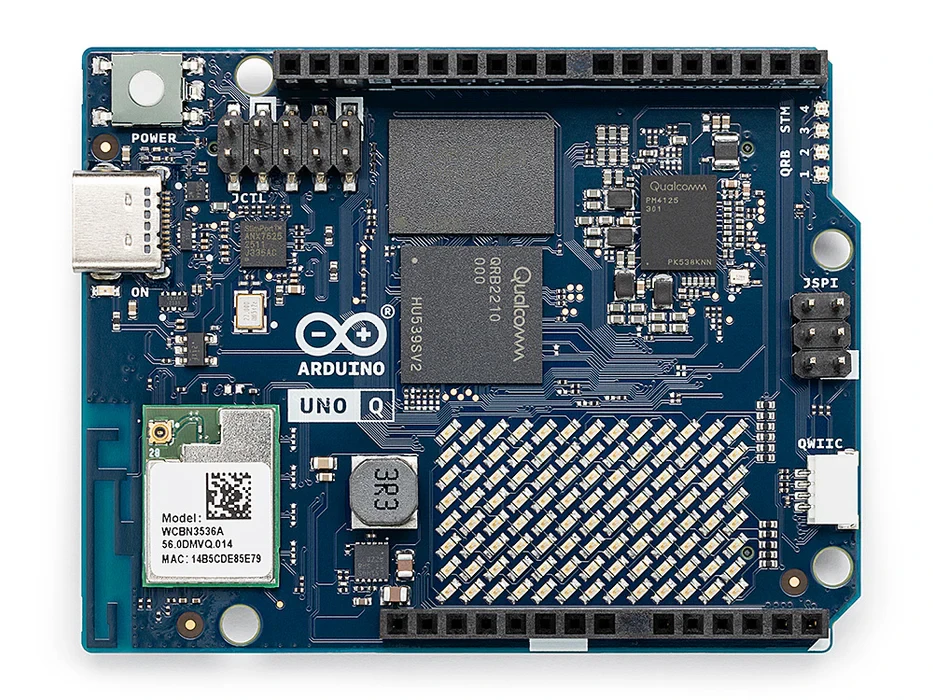 | 1 | QRB2210 quad-A53 + STM32U585 | Main controller (Linux SBC + MCU), App Lab |
| **L298N** dual H-bridge | 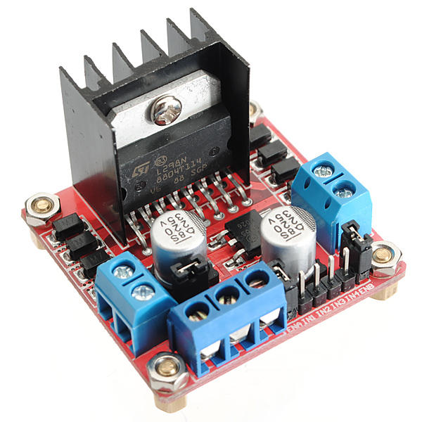 | 1 | 2 A/channel, up to 46 V | Motor driver for the DC drive motor |
| **DC drive motor** | 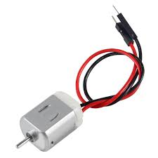 | 1 | brushed, ~3–6 V | Propels the vehicle (via the L298N) |
| **Steering servo** | 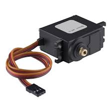 | 1 | PWM, 4.8–6 V, ~180° | Steers the front wheels (signal on D9) |
| **GY-521 (MPU-6050)** | 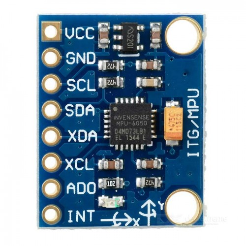 | 1 | 6-axis, ±2000 °/s, I²C | Gyro heading hold (yaw) |
| **Logitech camera** | 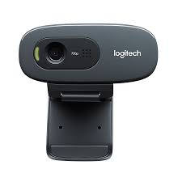 | 1 | USB UVC, 720p @ 30 fps | Computer vision (pillars & obstacles) |
| **Battery** | 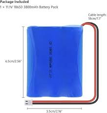 | 1 | 11.1 V 3S 18650, ~3800 mAh | Main power supply |
| **Jumper cables** | 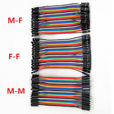 | as needed | Dupont, 2.54 mm pitch | Wiring between modules |

<details>
<summary><b>📋 Full component specifications (researched & sourced)</b></summary>

<br>

> [!NOTE]
> Electronics specs (UNO Q, L298N, MPU-6050) are confirmed against official
> datasheets/pages. Items tagged **representative** are typical values for that class of
> part — the exact model isn't confirmed; verify against the real hardware.

#### 🧠 Arduino UNO Q
- **Application processor:** Qualcomm Dragonwing QRB2210 — quad-core Arm Cortex-A53 @ 2.0 GHz (runs Debian Linux)
- **Real-time MCU:** STM32U585 — Arm Cortex-M33 @ 160 MHz, 2 MB flash, 786 kB SRAM
- **RAM / storage:** 2 GB LPDDR4 + 16 GB eMMC (or 4 GB + 32 GB variant)
- **Wireless:** Wi-Fi 5 (2.4/5 GHz) + Bluetooth 5.1
- **USB / power:** USB-C (host/device, video out); 5 V @ 3 A, VIN 7–24 V
- **I/O:** UNO headers + Qwiic; I²C/SPI/UART/PWM/CAN/ADC/GPIO; 8×13 LED matrix, 4 RGB LEDs
- **Dimensions:** 68.85 × 53.34 mm
- Sources: [store.arduino.cc](https://store.arduino.cc/products/uno-q) · [docs.arduino.cc](https://docs.arduino.cc/hardware/uno-q/)

#### ⚙️ L298N dual H-bridge motor driver
- **Motor supply:** up to 46 V max (typical use 5–35 V)
- **Logic supply:** 5 V (onboard 78M05 regulator when Vs ≤ 12 V)
- **Current:** 2 A continuous per channel (4 A total), 3 A peak (non-repetitive)
- **Channels:** 2 full H-bridges → 2 DC motors bidirectional
- **Based on:** STMicroelectronics L298 dual full-bridge driver
- Sources: [ST L298 datasheet](https://www.st.com/resource/en/datasheet/l298.pdf) · [components101](https://components101.com/modules/l293n-motor-driver-module)

#### 🧭 GY-521 (MPU-6050) 6-axis IMU
- **Sensors:** 3-axis gyroscope + 3-axis accelerometer (6 DOF) + temperature
- **Ranges:** gyro ±250/500/1000/2000 °/s; accel ±2/4/8/16 g (programmable)
- **Interface:** I²C ≤ 400 kHz; address 0x68 (0x69 if AD0 = high)
- **Voltage:** module 3.3–5 V (onboard regulator)
- **DMP:** onboard Digital Motion Processor (offloads motion fusion)
- Sources: [protosupplies](https://protosupplies.com/product/mpu-6050-gy-521-3-axis-accel-gryo-sensor-module/) · [datasheet](https://mysii.gorriens.net/images/arduino/capteurs/gy-521_mpu-6050_3-axis_gyroscope_and_acceleration_sensor_en.pdf)

#### 🎚️ Steering servo &nbsp;·&nbsp; *representative (SG90-class)*
- **Voltage:** 4.8–6 V DC
- **Torque:** ~1.8 kg·cm @ 4.8 V → ~2.2 kg·cm @ 6 V
- **Speed:** ~0.1 s/60°
- **Rotation:** ~180°; **weight** ~9 g
- **Interface:** 3-wire PWM (50 Hz, 1–2 ms pulse, 1.5 ms ≈ centre)
- Sources: [components101](https://components101.com/motors/servo-motor-basics-pinout-datasheet) · [servodatabase](https://servodatabase.com/servo/towerpro/sg90) — *confirm exact model*

#### 🔁 DC drive motor &nbsp;·&nbsp; *representative (TT/N20-class)*
- **Type:** brushed DC motor with reduction gearbox
- **Voltage:** ~3–6 V typical (hobby car motor)
- **No-load RPM:** ~150–200 RPM (TT gearmotor at 5–6 V)
- **No-load current:** ~120–180 mA
- **Note:** the L298N drops ~2 V, so effective motor voltage is below the supply rail
- Sources: [zbotic](https://zbotic.in/tt-gear-motor-for-robot-car-voltage-rpm-tire-matching/) · [lastminuteengineers](https://lastminuteengineers.com/l298n-dc-stepper-driver-arduino-tutorial/) — *confirm exact model*

#### 📷 Logitech USB camera &nbsp;·&nbsp; *representative (C270-class)*
- **Resolution:** 1280 × 960 (1.2 MP); video up to 720p @ 30 fps
- **Field of view:** ~60° diagonal
- **Connection:** USB 2.0, UVC plug-and-play (works with V4L2 / OpenCV, no vendor driver)
- Sources: [Logitech C270 specs](https://support.logi.com/hc/en-us/articles/360023462093-Logitech-HD-Webcam-C270-Technical-Specifications) — *confirm exact model (a C920 would be 1080p / ~78° FOV)*

#### 🔋 Battery — 11.1 V 3S 18650 Li-ion pack
- **Chemistry / config:** Lithium-ion 18650, 3S (3 cells in series)
- **Voltage:** 11.1 V nominal, 12.6 V full charge, ~9.0–9.2 V cutoff
- **Capacity:** ~3800 mAh (≈42 Wh)
- **Protection:** typically a BMS (over-charge / over-discharge / short)
- **Note:** powers the L298N rail + electronics; charge with a 12.6 V 3S charger, never below cutoff
- Sources: [Ufine](https://www.ufinebattery.com/products/11-1-v-3000mah-18650-battery-pack-18650-3s/) · [Rytronics](https://www.rytronics.in/product/11-1v-2600mah-18650-3s-1c-li-ion-battery-pack-with-bms/) — *11.1 V/3S confirmed; capacity representative*

#### 🔌 Dupont jumper wires
- **Pitch:** 2.54 mm (0.1") — matches headers/breadboards
- **Gauge:** ~24–28 AWG stranded copper
- **Types:** male-male, male-female, female-female; **length** ~10/20/30 cm
- **Rating:** ~3 A per contact; friction-fit (can loosen under vibration)
- Source: [Keszoox DuPont guide](https://keszoox.com/blogs/news/dupont-connector-complete-guide)

</details>

---

## 🔌 Wiring

| Servo wire | Connect to |
|------------|------------|
| Signal (orange/white) | **D9** |
| V+ (red) | external **5–6 V** supply |
| GND (brown/black) | supply GND **and** a board GND (shared ground) |

<div align="center">
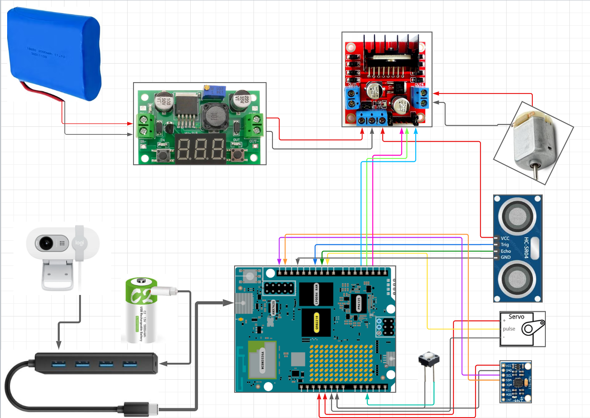
</div>

<details>
<summary><b>🔧 Full pin map</b></summary>

<br>

| Signal | Pin | Notes |
|--------|-----|-------|
| Steering servo | **D9** | PWM-capable on the UNO Q |
| Motor ENA (speed) | **D3** | L298N PWM |
| Motor IN1 / IN2 | **D6 / D5** | L298N direction |
| MPU-6050 SDA / SCL | **A4 / A5** | I²C (core ≥ 0.55.2) |

</details>

---

## 🤖 Vehicle Gallery

<div align="center">

| 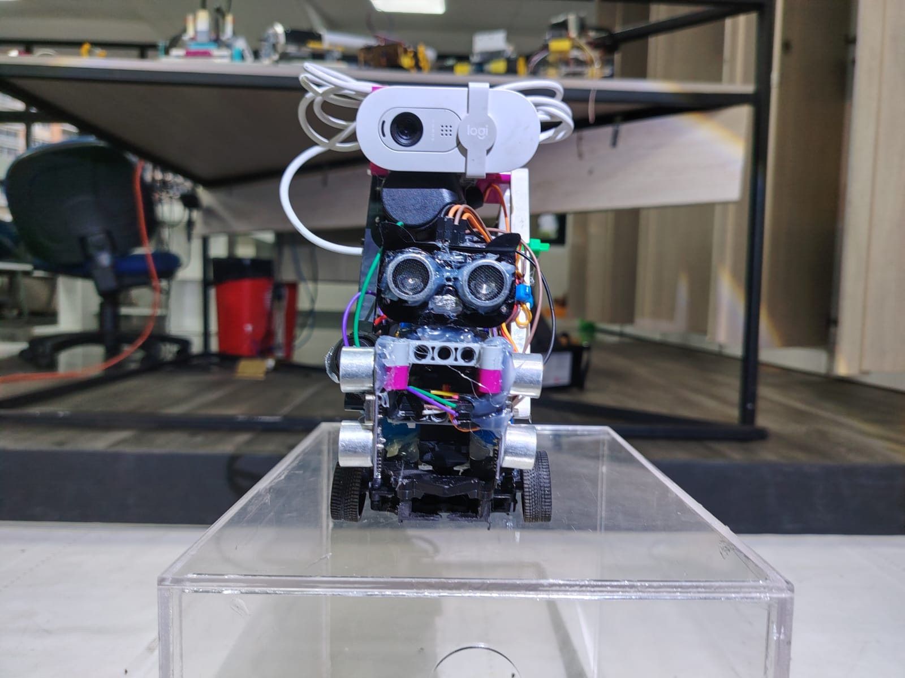 | 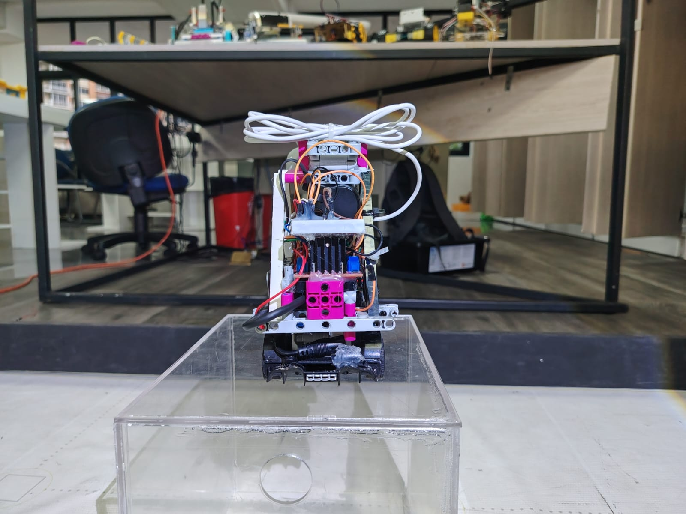 | 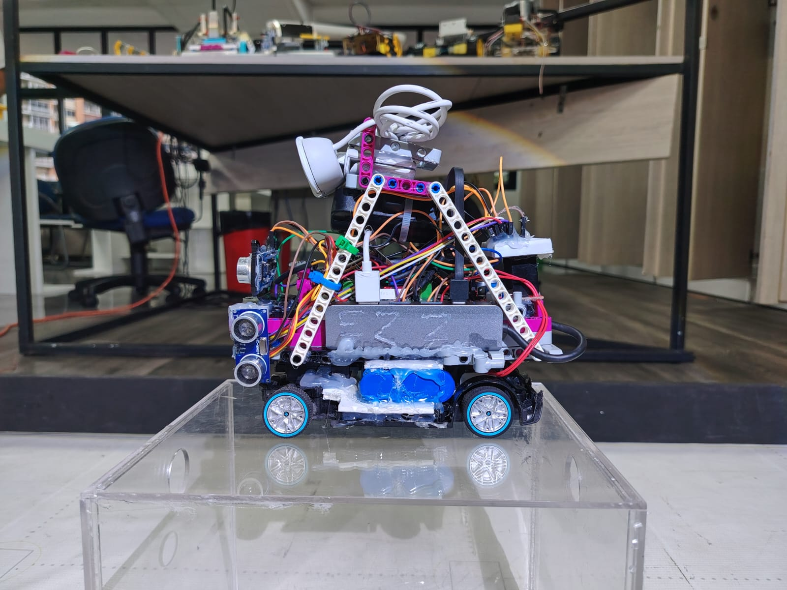 |
|:--:|:--:|:--:|
| **Front** | **Back** | **Left** |
| 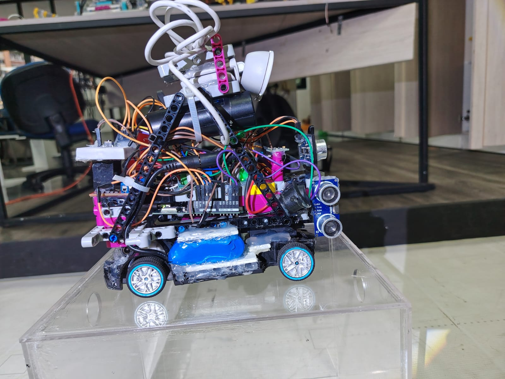 | 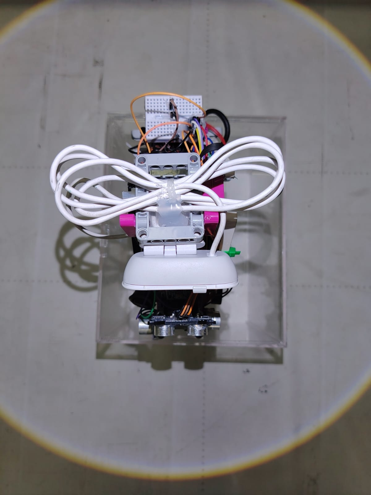 | 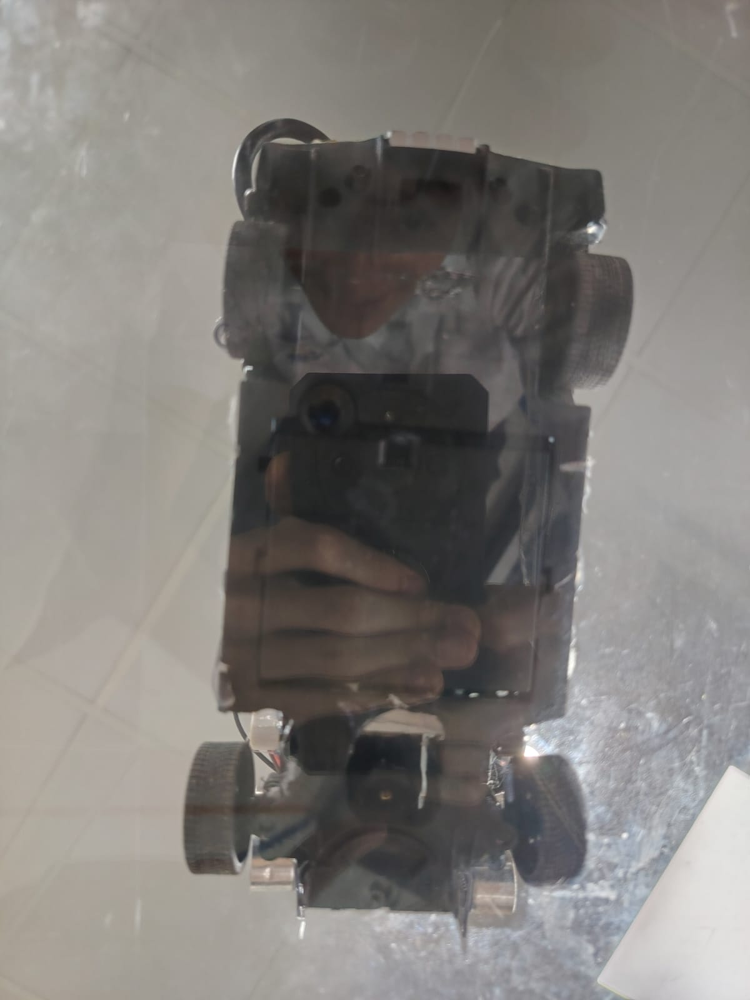 |
| **Right** | **Top** | **Bottom** |

</div>

---

## 🎥 Video

The driving-demonstration video link lives in [`video/video.md`](video/video.md).

> [!NOTE]
> A hosted video isn't published yet. Once it is, this section shows a clickable YouTube
> thumbnail linking to the run.

---

## 🛠️ Engineering Journey

> [!NOTE]
> The full story of the problems we solved — the Raspberry Pi first version, the servo‑PWM
> issue, the switch to the Arduino UNO Q, and the web‑UI servo calibration (**centre = 79°**)
> — is written up in **[`other/fabrication-challenges.md`](other/fabrication-challenges.md)**.

---

## ⚙️ UNO Q Gotchas

> [!WARNING]
> - **PWM pins:** on Zephyr `servo.attach(pin)` needs a hardware-PWM pin. If the servo
>   doesn't move on **D9**, try another PWM header pin (e.g. D3 or D6).
> - Keep **Servo ≥ 1.3.0** in `sketch.yaml`.
> - The UNO Q I²C is core-version-dependent — use **A4/A5** with core **≥ 0.55.2**; the
>   Qwiic connector has been reported flaky.
> - Use App Lab's **`Monitor`**, not the classic IDE Serial Monitor.

---

## 👥 Team

**Robotech La Salle** — La Salle, Panamá 🇵🇦

<div align="center">

| 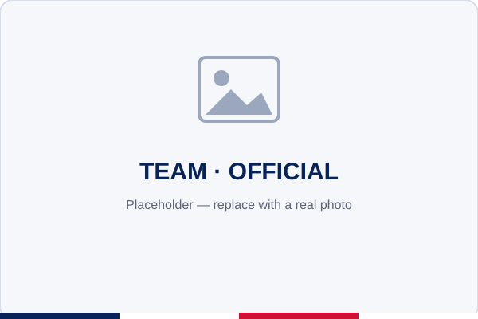 | 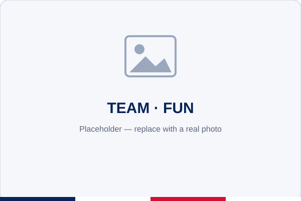 |
|:--:|:--:|
| **Official team photo** | **Team (fun)** |

</div>

<div align="center">
<br>

<br>
<sub>Built by <b>Robotech La Salle</b> · Panamá 🇵🇦 · WRO 2026 — Future Engineers</sub>
</div>
